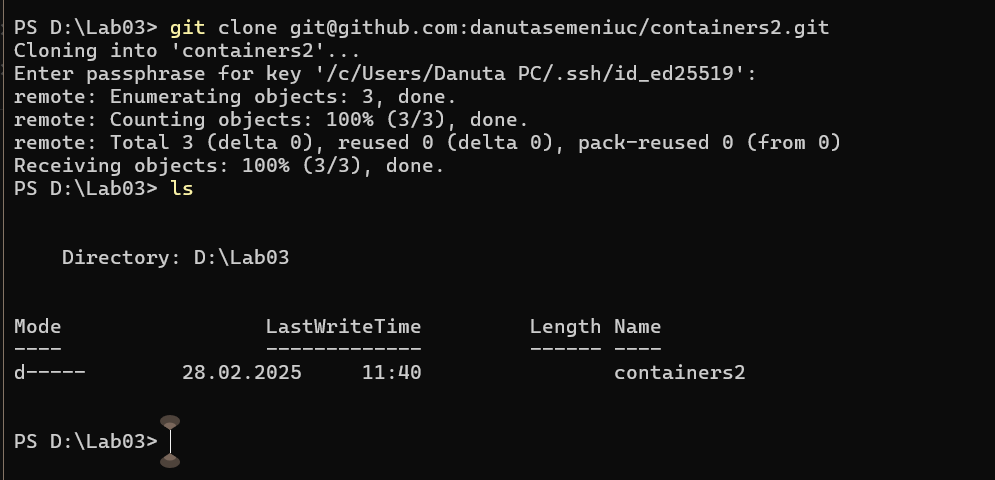
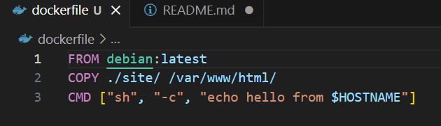
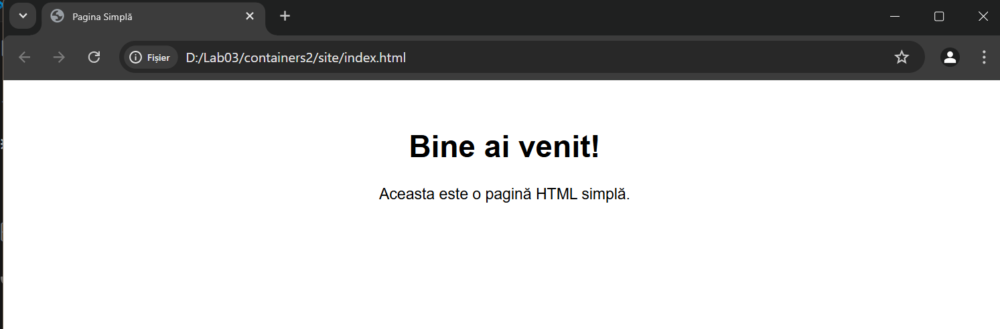
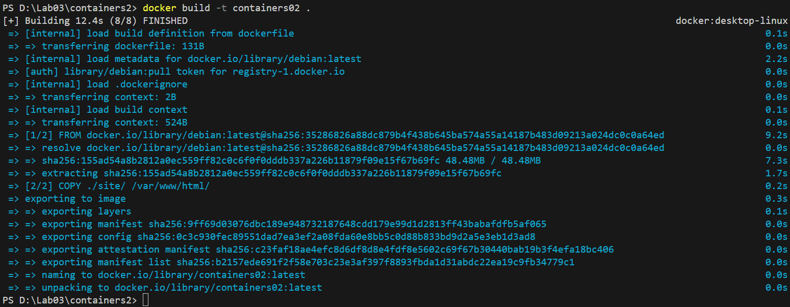
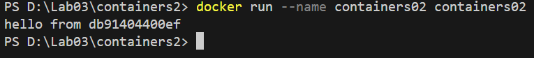
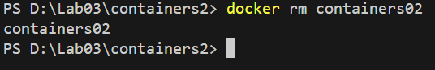
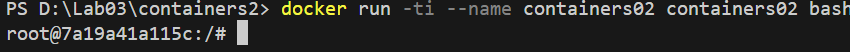
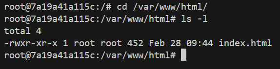

# Instalarea Docker Desktop
___

## Scop:
Această lucrare de laborator familiarizează cu elementele de bază ale containerizării și pregătește spațiul de lucru pentru următoarele lucrări de laborator.

## Sarcina:
Instalarea Docker Desktop și verificarea funcționării acestuia.

***

## Descrierea executării lucrării:

### 1. Instalarea Docker Desktop
Am descărcat și instalat Docker Desktop conform instrucțiunilor oficiale.

### 2. Crearea proiectului
Am creat un repozitoriu `containers02` și l-am clonat pe computer.


### 3. Crearea fișierului `Dockerfile`
Am adăugat următorul conținut:
```Dockerfile
FROM debian:latest
COPY ./site/ /var/www/html/
CMD ["sh", "-c", "echo hello from $HOSTNAME"]
```


### 4. Crearea directorului `site`
Am creat un fișier `index.html` cu conținut arbitrar.


### 5. Construirea imaginii Docker
Am rulat comanda:
```sh
docker build -t containers02 .
```
Durata creării imaginii: 


### 6. Pornirea containerului
Am executat comanda:
```sh
docker run --name containers02 containers02
```
Mesaj afișat în consolă: 


### 7. Ștergerea și repornirea containerului
Am executat comenzile:
```sh
docker rm containers02
docker run -ti --name containers02 containers02 bash
```


În fereastra deschisă, am verificat conținutul directorului `/var/www/html/`:
```sh
cd /var/www/html/
ls -l
```

Rezultatul afișat pe ecran: 


### 8. Închiderea containerului
Am folosit comanda:
```sh
exit
```
***


## Concluzii
Prin această lucrare de laborator, am reușit să ne familiarizăm cu conceptele de bază ale containerizării folosind Docker. Am învățat să instalăm Docker Desktop, să creăm imagini și să rulăm containere. De asemenea, am experimentat cu copierea fișierelor într-un container și verificarea conținutului acestuia. Aceste cunoștințe vor fi esențiale pentru lucrările de laborator viitoare, unde vom aprofunda utilizarea containerizării pentru diverse aplicații.

___

## Bibliografie
- [Documentația oficială Docker](https://docs.docker.com/)
